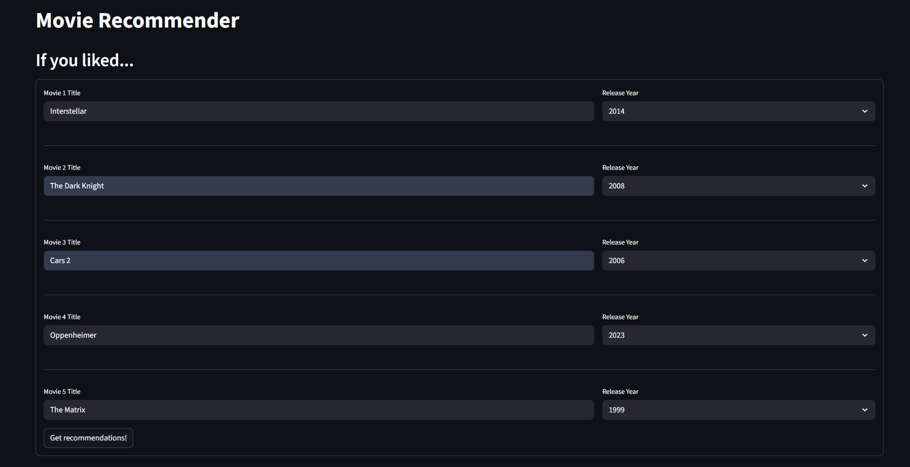
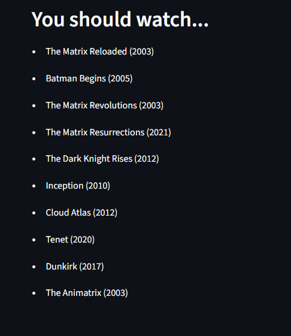

# Movie Recommender System

## Description
This project is a **content-based movie recommender** built using Python and Streamlit.  
Users provide a list of movies they like, and the system generates personalized movie recommendations based on the combined “feel” of those movies.  

The recommendation engine uses **TF-IDF vectorization** of movie metadata (genres, keywords, cast, directors) and **cosine similarity** to find movies most similar to the user’s preferences.
The data cleaning and vectorization process can be found in "preparation.ipynb"

---

## Features
- Accepts up to 5 movies from the user.
- Handles approximate title matches by standardizing input.
- Computes a **user preference vector** by averaging the selected movie vectors.
- Generates **top 10 recommended movies** based on cosine similarity.
- Simple and responsive **web interface** built with Streamlit.

---

## Tech Stack
- **Python** – backend logic and vector operations  
- **Streamlit** – frontend interface  
- **Pandas** – data handling and cleaning
- **Scikit-learn** – TF-IDF vectorization and cosine similarity  
- **SciPy** – sparse matrix operations  

---

## Setup

1. Clone the repository:
```bash
git clone <repository-url>
cd movie-recommender
```
2. Install dependencies:
```bash
pip install -r requirements.txt
```
3. Ensure files are available
- Ensure that movies_db.csv and tf_matrix.npz are in the program's folder

4. Run app
```bash
python -m streamlit run app.py   
```

## Screenshots

Entering movies:



Receiving recommendations:




## Future Immprovements

- Obtain data on other users' movies and ratings in order to train a ML model to 
  recommend movies based on what users with similar profile vectors liked